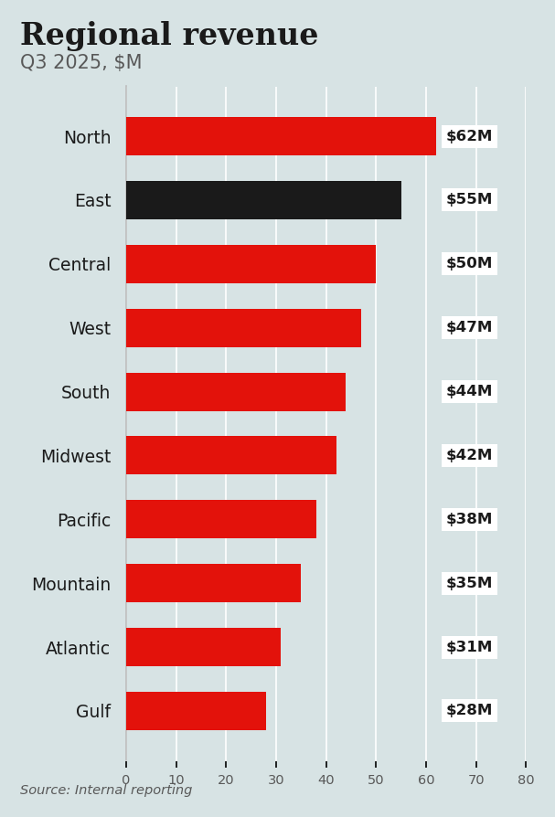
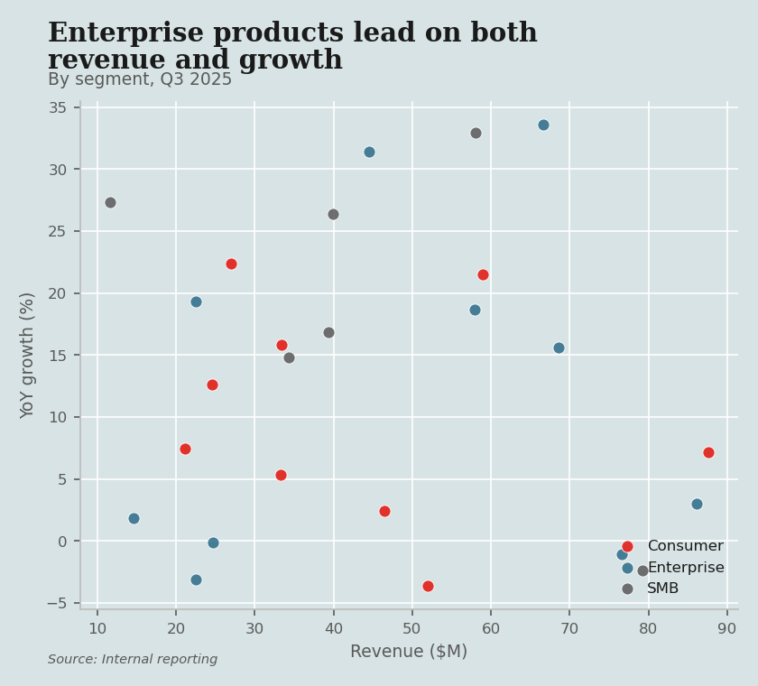
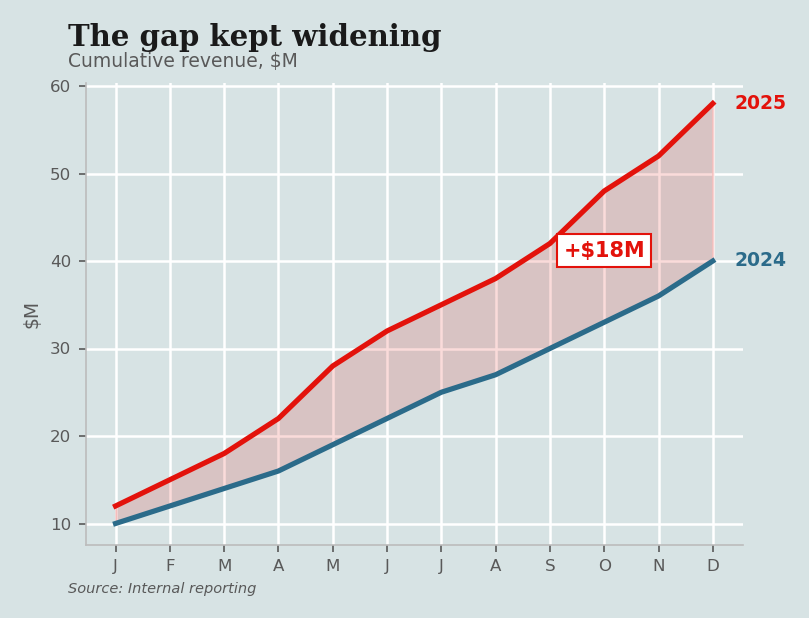
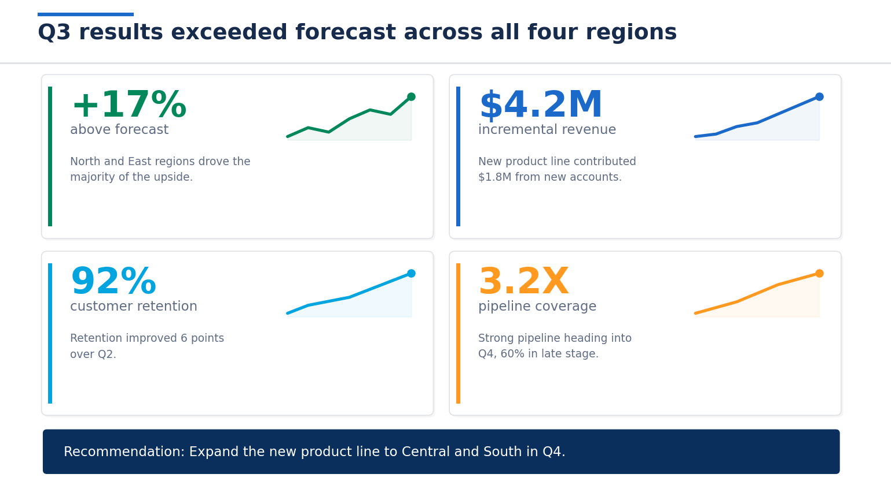
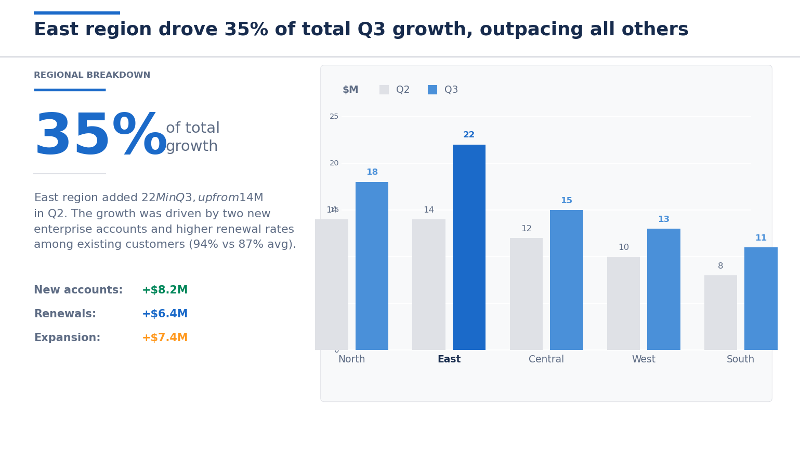

# claude-skills-data-science

Custom [Claude Code](https://claude.ai/code) skills for data scientists, statisticians, and analysts.

These skills are reusable prompts that plug into Claude Code as slash commands. They enforce consistent standards for writing, visualization, and presentation across projects.

## Skills

### [`clear-writing-for-data`](clear-writing-for-data/)

Tightens prose for data professionals. Plain words, short sentences, active voice, no jargon. Works on resumes, cover letters, reports, slide decks, documentation, and any text that explains data or analytics to a broader audience.

**Before:**

> An ML-based provider linkage system utilizing random forest classification and string distance metrics was developed and implemented, which resulted in a significant increase in cohort size of approximately 50%, thereby enabling more robust downstream analytical capabilities.

**After:**

> We linked provider records using name and address matching, which grew cohorts by half.

**Before:**

> Delivered actionable, data-driven insights to key stakeholders leveraging innovative analytical methodologies to drive strategic decision-making across the enterprise.

**After:**

> Told the sales team which regions were underperforming and why.

**Core rules (summary):**

| Rule | Example |
|---|---|
| Use short words | *use* not *utilize*, *buy* not *purchase*, *about* not *approximately* |
| Cut filler words | Remove *basically, extremely, significantly, very, quite, really* |
| Active voice | "We analyzed the data" not "The data was analyzed" |
| Positive form | "He forgot" not "He did not remember" |
| Lead with findings | "Cohorts grew by half" not "A system was developed that increased cohort size" |
| Name the audience | "Told the sales team" not "Delivered insights to stakeholders" |
| Make metrics concrete | "Conversion rose from 2% to 5%" not "Significant improvement in metrics" |

---

### [`visualizing-data`](visualizing-data/)

Creates publication-quality data visualizations with matplotlib and seaborn. Covers chart selection, color palettes, labeling, accessibility, and common pitfalls.

**What it does:**

Given a dataset and a question, the skill picks the right chart type, applies a clean visual style (Tableau 10 palette, readable fonts, subtle gridlines), and follows best practices for labeling, annotation, and accessibility.

**Includes:**
- `SKILL.md`: Guidelines for data integrity, chart selection, style (palette, fonts, gridlines, DPI), labeling, common problems (misleading, confusing, ugly charts), and a pre-publish checklist.
- `charts.md`: Copy-pastable matplotlib code for 9 chart types: vertical grouped bar, butterfly, stacked dot/panel, scatter, packed circle/bubble, horizontal stacked bar, line with secondary y-axis, timeline/area, and stacked bar with inline numbers. Plus common patterns for size legends, colorbars, and diverging colormaps.

**Chart selection guide:**

| Message | Chart |
|---|---|
| Trend over time | Line chart |
| Comparison | Bar chart (vertical or horizontal) |
| Part-to-whole | Stacked bar or pie (2-3 slices only) |
| Relationship | Scatter plot |
| Distribution | Histogram or box plot |

**Example output:**

| Grouped Bar | Scatter Plot | Timeline |
|---|---|---|
|  |  |  |

**Key principles:**
- Title states the finding, not the chart type: "Revenue rose 4X in Q3" not "Revenue by Quarter"
- Direct labels on the data, not in a separate legend
- Five-second test: can a reader grasp the point in five seconds?
- No 3D, no gradients, no decorative elements

---

### [`presenting-data`](presenting-data/)

Builds data presentations with python-pptx. Combines findings-first storytelling (Pyramid Principle, SCR framework) with production-quality slide generation.

**What it does:**

Given findings and data, the skill structures a slide deck that argues a point, not just displays information. It generates python-pptx code for each slide, following consistent layout patterns, brand colors, and typography.

**Includes:**
- `SKILL.md`: Storytelling structure (Pyramid Principle, SCR), action titles, slide content quality rules, brand palette (Reasonable Colors, WCAG accessible), python-pptx fundamentals (placeholder trap, font handling, rich text), slide anatomy with exact measurements, chart embedding, title slides, editable shapes vs PNG, architecture diagrams, common pitfalls table, writing style, and a 13-point checklist.
- `layouts.md`: Copy-pastable python-pptx code for 8 layout types: executive summary cards, data slide (left text + right chart), full-width chart, two-column, funnel/attribution diagram, tile grid, callout box, and shape copying from external PPTX. Plus utility functions for pills, thin lines, rich textboxes, and labeled value lines.

**Storytelling framework:**

```
Slide 1:  Title (provocative statement or question)
Slide 2:  Executive Summary (give away the answer first)
Slide 3:  Context/setup (situation + complication)
Slide 4-N: Evidence (one finding per slide)
Final:    Actions with prioritization and expected impact
```

**Example output:**

| Executive Summary | Hero Slide (Left Text + Right Chart) |
|---|---|
|  |  |

**Key principles:**
- Every slide title is a complete sentence stating the finding
- Reading titles in sequence should tell the full story
- The "so what" test: every finding needs a business implication
- Quantify everything: "3 of 5 regions" not "some regions"

**Slide anatomy:**

```
+------------------------------------------------------+
| Title (14pt)                                  ~0.50"  |
|------------------------------------------------------|
|                                                       |
| Body content area                                     |
| (starts ~1.14", ends at ~6.98")                       |
|                                                       |
+------------------------------------------------------+
| Footer zone (~7.08")                                  |
+------------------------------------------------------+
```

---

### [`coding-standards`](coding-standards/)

Python coding standards for data science projects. Covers comments, docstrings, error handling, naming conventions, imports, project structure, and a pre-commit checklist.

**What it does:**

Enforces consistent, readable Python code across data science work. Focuses on the patterns that matter most in analytical codebases: clear naming, typed function signatures, structured logging, and defensive error handling.

**Core rules (summary):**

| Rule | Example |
|---|---|
| Comments explain why, not what | "Cap at 95th percentile to reduce outlier skew" not "Apply caps" |
| Type hints on all functions | `def transform(df: pd.DataFrame, cols: List[str]) -> pd.DataFrame:` |
| Snake_case, descriptive names | `quarterly_revenue` not `qr` or `data2` |
| Guard clauses over nesting | Return early for edge cases, keep the happy path unindented |
| Structured logging | `logger.info("Loaded %d rows from %s", len(df), source)` |

---

## Install

**Option 1: Install all skills**

```bash
git clone https://github.com/TavoloPerUno/claude-skills-data-science.git
cd claude-skills-data-science
./install.sh
```

**Option 2: Copy one skill**

```bash
git clone https://github.com/TavoloPerUno/claude-skills-data-science.git
cp -r claude-skills-data-science/clear-writing-for-data ~/.claude/skills/
```

**Option 3: Single file install**

```bash
mkdir -p ~/.claude/skills/clear-writing-for-data
curl -o ~/.claude/skills/clear-writing-for-data/SKILL.md \
  https://raw.githubusercontent.com/TavoloPerUno/claude-skills-data-science/main/clear-writing-for-data/SKILL.md
```

## Usage

In any Claude Code session:

```
/clear-writing-for-data
/visualizing-data
/presenting-data
/coding-standards
```

The skills can also be triggered automatically by Claude when it detects relevant context (e.g., writing prose, creating charts, or building slides).

## Adding new skills

Each skill is a folder at the root containing a `SKILL.md` file:

```
skill-name/
  SKILL.md
  [optional supporting files: code patterns, templates, examples]
```

The folder name becomes the slash command (`/skill-name`).

## Sources

- **clear-writing-for-data**: Drawing on widely known principles of clear English prose, inspired by Strunk & White's *The Elements of Style*, George Orwell's "Politics and the English Language," and The Economist's house style. Data-specific rules are original.
- **visualizing-data**: Based on Edward Tufte's principles of data visualization, with practical matplotlib/seaborn implementation patterns.
- **presenting-data**: Based on Barbara Minto's Pyramid Principle, the SCR storytelling framework, and python-pptx production techniques.

## License

MIT
